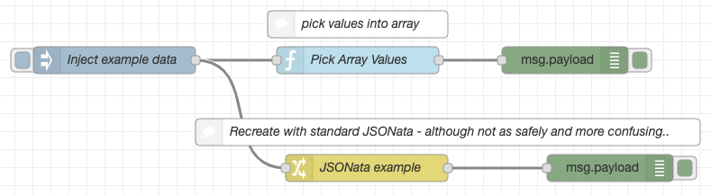

# Overview

Utility nodes for working with literal values.

Note, we also describe some cases where Out of the Box functionality may also compare.

# Array

Nodes to help with working with Arrays.

## Pick Array Value

Given an array of objects, picks a value within each object to put inside of an array.

(This works very well with other nodes like [node-red-contrib-serial-iterator](https://flows.nodered.org/node/node-red-contrib-serial-iterator)

For example, we want the following:

	[
		 "/services/data/v42.0/sobjects/AcceptedEventRelation",
		 "/services/data/v42.0/sobjects/Account",
		 "/services/data/v42.0/sobjects/AccountChangeEvent",
		 "/services/data/v42.0/sobjects/AccountCleanInfo"
	]

From a message like the following:

	{
	  "payload": {
		"results": {
		  "sobjects": [
			{
			  "name": "AcceptedEventRelation",
			  "urls": {
				"sobject": "/services/data/v42.0/sobjects/AcceptedEventRelation"
			  }
			},
			{
			  "name": "Account",
			  "urls": {
				"sobject": "/services/data/v42.0/sobjects/Account"
			  }
			},
			{
			  "name": "AccountChangeEvent",
			  "urls": {
				"sobject": "/services/data/v42.0/sobjects/AccountChangeEvent"
			  }
			},
			{
			  "name": "AccountCleanInfo",
			  "urls": {
				"sobject": "/services/data/v42.0/sobjects/AccountCleanInfo"
			  }
			}
		  ]
		}
	  }
	}

We would like a collection of all the 'sobject' values...

If we configure the node with the following

* arrayPath: 'payload.results.sobjects'
* valuePath: 'urls.sobject'
* targetPath: 'payload.objectUrls'

We'll get:

	{
	   "payload":{
		  "results":{
			 "sobjects":[
				...
			 ]
		  },
		  "objectUrls":[
			 "/services/data/v42.0/sobjects/AcceptedEventRelation",
			 "/services/data/v42.0/sobjects/Account",
			 "/services/data/v42.0/sobjects/AccountChangeEvent",
			 "/services/data/v42.0/sobjects/AccountCleanInfo"
		  ]
	   }
	}

### Example Flow

	[{"id":"195e7da2.f7e152","type":"tab","label":"Flow 1","disabled":false,"info":""},{"id":"84b77a17.25be68","type":"inject","z":"195e7da2.f7e152","name":"Inject example data","topic":"","payload":"{\"results\":{\"sobjects\":[{\"name\":\"AcceptedEventRelation\",\"urls\":{\"sobject\":\"/services/data/v42.0/sobjects/AcceptedEventRelation\"}},{\"name\":\"Account\",\"urls\":{\"sobject\":\"/services/data/v42.0/sobjects/Account\"}},{\"name\":\"AccountChangeEvent\",\"urls\":{\"sobject\":\"/services/data/v42.0/sobjects/AccountChangeEvent\"}},{\"name\":\"AccountCleanInfo\",\"urls\":{\"sobject\":\"/services/data/v42.0/sobjects/AccountCleanInfo\"}}]}}","payloadType":"json","repeat":"","crontab":"","once":false,"onceDelay":0.1,"x":170,"y":140,"wires":[["f19fef07.d63f1","a03caddb.c460d"]]},{"id":"f19fef07.d63f1","type":"pick-array-value","z":"195e7da2.f7e152","name":"","arrayPath":"payload.results.sobjects","valuePath":"urls.sobject","targetPath":"payload.urls","x":440,"y":140,"wires":[["a896839a.1e206"]]},{"id":"a896839a.1e206","type":"debug","z":"195e7da2.f7e152","name":"","active":true,"tosidebar":true,"console":false,"tostatus":false,"complete":"false","x":670,"y":140,"wires":[]},{"id":"f42689cd.93e158","type":"comment","z":"195e7da2.f7e152","name":"pick values into array","info":"","x":440,"y":100,"wires":[]},{"id":"a03caddb.c460d","type":"change","z":"195e7da2.f7e152","name":"JSONata example","rules":[{"t":"set","p":"payload.urls","pt":"msg","to":"(\t    $map(payload.results.sobjects, function($val, $index, $array) {\t       $val.urls.sobject\t    })\t)","tot":"jsonata"}],"action":"","property":"","from":"","to":"","reg":false,"x":450,"y":260,"wires":[["f8952828.8b4148"]]},{"id":"cc3f35ab.8b7218","type":"comment","z":"195e7da2.f7e152","name":"Recreate with standard JSONata - although not as safely and more confusing..","info":"","x":540,"y":220,"wires":[]},{"id":"f8952828.8b4148","type":"debug","z":"195e7da2.f7e152","name":"","active":true,"tosidebar":true,"console":false,"tostatus":false,"complete":"false","x":720,"y":260,"wires":[]}]
	

### Props

<table>
	<tr>
		<th>Name</th>
		<th>Description</th>
		<th>Value</th>
	</tr>
	<tr>
		<td>Array Path</td>
		<td>The path within the message to the Array to iterate over</td>
		<td>payload.describe.sobjects</td>
	</tr>
	<tr>
		<td>Value Path</td>
		<td>The path within the array's objects to the value we should collect.</td>
		<td>urls.layoutURL</td>
	</tr>
	<tr>
		<td>Target Path</td>
		<td>The path within the message we should put the resulting array of collected values.</td>
		<td>payload.layouts</td>
	</tr>
</table>

# Extending

## Running Tests
* To test the project run `npm run test` or `npm run test:watch` to continuously test.

## Running Linter
* To run linters on the project, run `npm run lint` or `npm run lint:watch` to continously lint.
