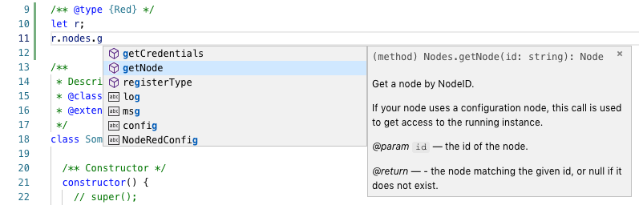

# Overview

This is a very simple seed project for starting a new Node-Contrib module project.

# What you will need

* node (with es6+ supported)
* node-red (running 0.20+)

# Scripts

<table>
	<tr>
		<th>Command</th><th>Description</th>
	</tr>
	<tr>
		<td>npm run lint</td>
		<td>Runs eslint against all the code in the nodes and tests directory</td>
	</tr>
	<tr>
		<td>npm run lint:watch</td>
		<td>Same as lint, only runs lint if any of the files in those directories change</td>
	</tr>
	<tr>
		<td>npm run test</td>
		<td>Runs mocha test (using the [node-red-node-test-helper](https://www.npmjs.com/package/node-red-node-test-helper)</td>
	</tr>
	<tr>
		<td>npm run test:watch</td>
		<td>Same as npm run test, only runs tests again if the files change.</td>
	</tr>
</table>

# Developing

While developing your component, its important that we can also test it within Node Red without having to constantly copy the files back and forth.

`npm link` greatly helps in this case - as we can use our local files directly
OR simply make a symbolic link to your Custom Nodes project within your Node Red running project...

**Step 1** run `npm link` within your node-contrib project.

(note the name of the project within the package.json. For example: [The name of the project defined here is: node-red-contrib-seed](https://github.com/paulroth3d/node-red-contrib-seed/blob/master/package.json#L2))

**Step 2** run `npm link [[your-project-name]]` within your node-red project directory.  (For example: `npm link node-red-contrib-seed`)

**Step 3** run Node-Red as normal.

# Deploying

When your component is ready do the following:

* verify that lint succeeds by running : `npm run lint` or `npm run lint:watch`
* verify that all tests succeed by running: `npm run test` or `npm run test:watch`
* update `index.js` to provide a facade to the inner es6 classes, so you can more easily extend them in other libraries.
* upde the `test/facade_spec.js` to ensure your classes can be found.
* add in 'node-red' as a keyword to the `package.json` - so it can be found at: [https://flows.nodered.org/](https://flows.nodered.org/)
* publish to npm

## Intellisense

We have taken great care to use the JSDoc Typescript support, so you can still get the introspection, and suggestions while working with your code - even though Node Red does not support typescript.

Please see the [nodes/Types.js](nodes/Types.js) file for definitions, and [nodes/example/your-component.js](nodes/example/your-component.js) for examples of it working...

----

# Learn More

## Starting Out

Check Out [Node Red: Creating Nodes](https://nodered.org/docs/creating-nodes/)

Also note the standard utilities available:

* Node Red built-in Editor UI Widgets (like TypedInput - a replacement for a regular &lt;input&gt; that allows the type of the value to be chosen, including options for string, number and boolean. Used extensively in the core Node-RED nodes.[https://nodered.org/docs/api/ui/](https://nodered.org/docs/api/ui/)
* Node Red Utility Methods - like the [getMessageProperty](https://nodered.org/docs/api/modules/v/0.20.0/@node-red_util_util.html#.getMessageProperty) and [setMessageProperty](https://nodered.org/docs/api/modules/v/0.20.0/@node-red_util_util.html#.setMessageProperty) commands used here.

## Creating Components

* If you would like to make a large textarea (like the template in this component), review the [handlebars.html](nodes/handlebars/handlebars.html)
  * [Although I couldn't find much documentation](https://discourse.nodered.org/t/solved-is-there-a-way-to-resize-to-full-page-the-node-edit-form/9283), create two properties, one that will be hidden (and the value) and the other to be the editor.
  * Note the `oneditprepare`, `oneditsave`, `oneditcancel` and `oneditresize` methods in the registerType - within the html page.

## Testing
* To test the project run `npm run test` or `npm run test:watch` to continuously test.
* When creating nodes, [Node Red uses mocha for its testing](https://nodered.org/docs/creating-nodes/first-node) - found in the [node-red-node-test-helper](https://www.npmjs.com/package/node-red-node-test-helper)
* Tests are made:
  * creating a flow: ex `const flow = [{id:'n1', type:'handlebars', name:'handlebars'}];`
  * loading your class into the flow, ex: `helper.load(handlebarsNode, flow, () => {...}`
  * finding the nodes generated within the flow, ex: `let n1 = helper.getNode('n1');`
  * adding event emitter listeners on the follow up nodes (to listen for teh response), ex: `n2.on("input", (msg) => {...}`
  * firing the 'receive' to push the payload onto your node, for it to flow through. ex: `n1.receive({payload:{...}});`
* [Note that Mocha does not force --exit by default](https://boneskull.com/mocha-v4-nears-release/#mochawontforceexit)

## Further Reading

* Using an Ace Editor for a node Property: [https://discourse.nodered.org/t/solved-is-there-a-way-to-resize-to-full-page-the-node-edit-form/9283](https://discourse.nodered.org/t/solved-is-there-a-way-to-resize-to-full-page-the-node-edit-form/9283)
